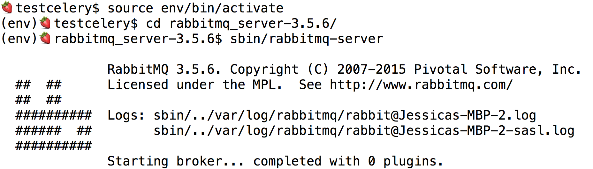
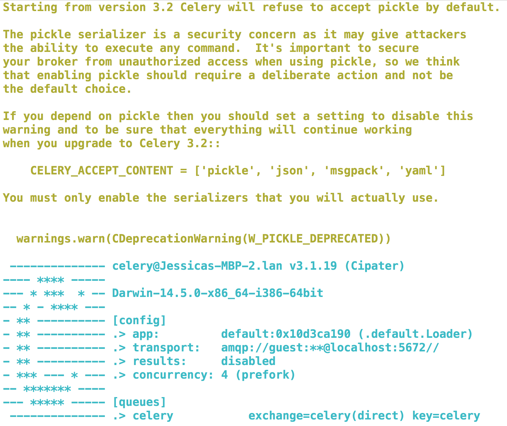
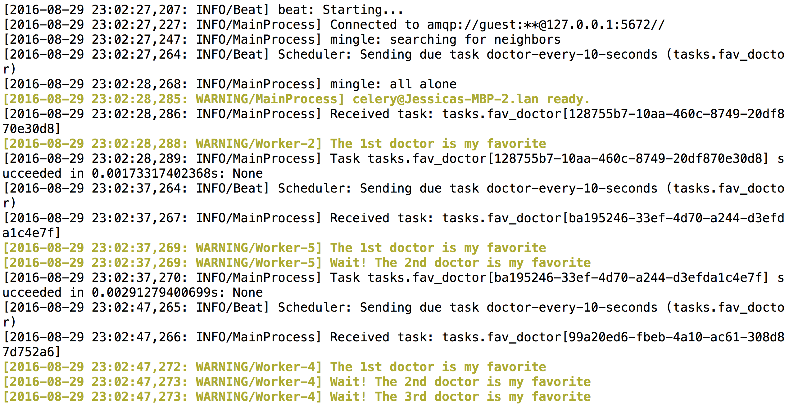

Simple Celery - Doctor Who
--------------------------


**Description**

A simple celery task using the heartbeat feature in Python.

Reads a file that prints to the console and writes to the file every 10 seconds.

For full details on the process of creating this project: [Viedo <coming soon>](https://www.youtube.com/channel/UCmAIHsNUyAzJ6FQMdU5jdRw), [Blog](https://chatasweetie.com/2016/09/02/celery-distributed-task-queue/)    

**How it works**

The Celery worker (celery is an asynchronous task queue/job queue based on distributed message passing) opens the text file and iterates over the file, printing to the console. At the end of the file, it addes to the file another iteration and closes the file. This repeats every 10 seconds. 


### Screenshot

**Starting RabbitMQ**



**Starting Celery Worker**



**Celery Worker**




### Technology Stack

**Application:** Python, Celery, RabbitMQ    


### How to run locally

Download [RabbitMQ](https://www.rabbitmq.com/)   


Create a virtual environment 

```
>>> virtualenv env
>>> source env/bin/activate
```

Install the dependencies

```
>>> pip install -r requirements.txt
```

Run RabbitMQ server

```
>>> cd rabbitmq_server-3.5.6/
>>> sbin/rabbitmq-server 
```

In a new terminal run Celery worker
```
>>> celery worker -l info --beat
```


### About the Developer    
Jessica Dene Earley    
[Short Bio](https://chatasweetie.com/about-me/)   
[Linkedin](https://www.linkedin.com/in/jessicaearley)    
[Chatasweetie's Blog](https://chatasweetie.com/)    